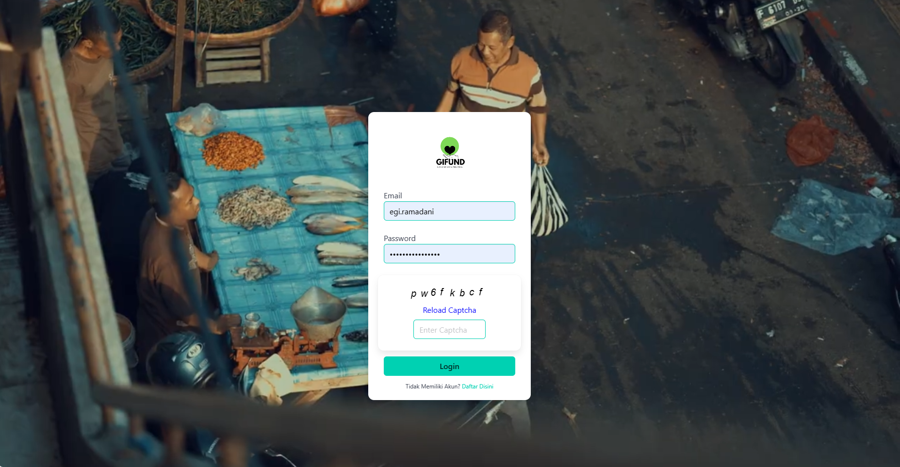

 

## :dart: About

GiFund is a Healing Fundraiser, where every donation makes a difference in someone's journey toward healing and recovery. Our platform is dedicated to supporting individuals in need of crucial medical treatments by providing them with a powerful tool to raise the necessary funds.

## :rocket: Technologies

The following tools were used in this project:

- [React](https://pt-br.reactjs.org/)
- [TypeScript](https://www.typescriptlang.org/)
- [Bulma](https://couds.github.io/react-bulma-components/?path=/docs/elements-image--default/)

Made with :heart: by <a href="https://github.com/egi321910004" target="_blank">Egi Rizki</a>

&#xa0;
